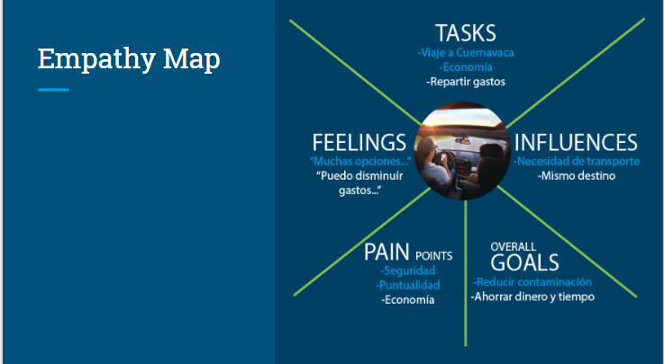
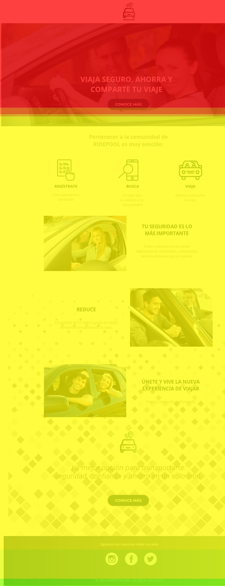

# RidepoolMX
## Desarrollado para [Laboratoria](https://http://laboratoria.la/)

##  Proyecto Sprint 1 - *Track UX Laboratoria*

* Nombre del proyecto: *RIDEPOOLMX**

*Objetivo*
Optimizar el journey que realiza un usuario que desea viajar de la CDMX a Cuernavaca.

*Equipo:*
+ Product Owner: Karina Quezada
+ UX Designer: Adriana Dillarza
+ UX Researchers: Marisol Juarez y Joali Gamboa

*Enunciado del problema*

+ Impulsar la plataforma de viajes colaborativos BlaBlaCar a través de un sistema de recompensas con el que se busca tener más suscripciones de usuarios a cambio de ofrecer mayor seguridad y confianza.

*Objetivo de negocio*

+ Impulsar una plataforma donde pasajeros, conductores y empresa ganan por medio de recompensas

*Empathy Map*

*Estrategia de Research*

+ Preguntas basadas en respuestas (el flujo de la encuesta se diseñó  dependiendo del perfil de usuario)
+ Horario de lanzamiento oportuno
+ Canal de difusión objetivo

Encuesta

*Retos de Investigación*

+ Se tuvieron algunos problemas en la recopilación de datos.
+ No se hicieron obligatorias las preguntas
+ Se dejaron muy abiertas algunas de las opciones planteadas en las respuestas
+ Omitimos preguntas importantes como el género de los usuarios

*Insights*

+ “Me interesa viajar cómodo, seguro y si de paso puedo ahorrar unos pesos, mucho mejor”
+ “Es interesante que existan comunidades de transporte colaborativo, pero no sé si confiar en ellos”
+ “Estaría genial compartir los asientos sobrantes de mi auto, esto reduciría el índice de contaminación, mi lema es: “más asientos ocupados y menos autos circulando”

*Solución Propuesta*

+  *RidepoolMx* es una plataforma de transporte colaborativo, donde los usuarios se podrán registrar como pasajeros y conductores, verificando  su identidad para que así todos los usuarios se sientan tranquilos al realizar sus viajes con nosotros.

*Beneficios de usar RidepoolMx*

+ Ahorras en tu viaje como pasajero y como conductor
+ Tendrás la seguridad de estar viajando con usuarios verificados
+ Tendrás varias opciones (de conductor/pasajero) para realizar tu viaje

*¿Cómo funciona Ridepool Mx?*

+ El usuario se registrará dependiendo de su perfil como pasajero o como conductor.
+ Se le solicitarán diferentes documentos con los cuales verificaremos sus identidad y con eso asegurar que nuestros usuarios son confiables.
+ Cuando una persona sea un usuario registrado de Ridepool Mx , podrá seleccionar su viaje y su conductor o pasajero.
+ Podrás pagar con tarjeta de crédito, débito o Paypal
+ Realiza tu viaje y disfruta.

*Producto para la solucion del problema: Landing Page*
+ Sketch:

*Prototipo*

*Evaluaciones*

HEATMAP

MOVEMENT

REBOTE

